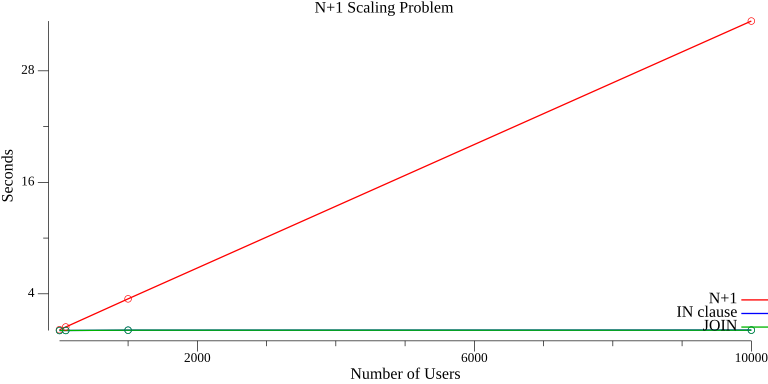

# go-nplus1-example

## Simulation results



## How to simulate

```bash
> docker compose up -d

[+] Running 1/2
 ⠹ Network go-nplus1-example_default  Created                                                                                                                                                               0.2s 
 ✔ Container go-nplus1-example-db-1   Started                                                                                                                                                               0.2s 

> go run ./benchmark
nplus1 10 0.12348420900000001
nplus1 100 0.420842083
nplus1 1000 3.474804208
nplus1 10000 33.033019
in_clause 10 0.053797791
in_clause 100 0.054189833
in_clause 1000 0.07876029200000001
in_clause 10000 0.094964625
join 10 0.054183125
join 100 0.057108083000000004
join 1000 0.08809725
join 10000 0.089842125
scaling.png generated

> open scaling.png

> docker compose down -v

[+] Running 2/2
 ✔ Container go-nplus1-example-db-1   Removed                                                                                                                                                               0.1s 
 ✔ Network go-nplus1-example_default  Removed 
```